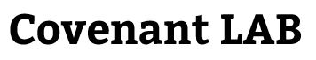

# Covenant LAB 

- Ko EonYack (Covenant)
- Director of Covenant LAB

## 🔥 교육 활동

  - 17년 08월: Covenant EDU 탄생
  - 17년 08월 - 17년 12월: HGU 파이썬 프로그래밍 17-2학기 튜터
  - 17년 12월 - 18년 01월: HGU C 프로그래밍 겨울계절학기 TA
  - 18년 08월 - 18년 12월: HGU C 프로그래밍 18-2학기 TA
  - 18년 12월 - 19년 01월: HGU C 프로그래밍 겨울계절학기 TA
  - 18년 12월 - 19년 01월: 모두를 위한 인공지능의 활용 교재 제작
  - 18년 12월 - 19년 02월: 포항 오*고등학교 사회봉사 파이썬 강의
  - 19년 01월 - 19년 01월: HGU 소프트웨어 입문 예비대학 TA  
  - 19년 03월 - 19년 06월: HGU 소프트웨어입문 19-1학기 TA
  - 19년 03월 - 19년 06월: HGU 모두를 위한 인공지능의 활용 19-1학기 TA
  - 19년 08월 - 19년 12월: HGU 모두를 위한 인공지능의 활용 19-2학기 TA
  - 19년 08월 - 19년 12월: KMOOC 파이썬으로 배우는 기계학습 입문 강좌운영 TA 
  - 19년 08월 - 19년 12월: HGU C프로그래밍 19-1학기 TA
  - 20년 03월 - 20년 06월: HGU 모두를 위한 인공지능의 활용 20-1학기 TA
  - 20년 03월 - 20년 06월: HGU 소프트웨어입문 20-1학기 TA
  - 20년 03월 - 29년 06월: KMOOC 파이썬으로 배우는 기계학습 입문 강좌운영 TA  [[강의정보]](http://www.kmooc.kr/courses/course-v1:HGUk+HGU05+2020_T1/about)
  - 20년 01월: Covenant 누적 방문 10만 돌파 [covenant.tistory.com](covenant.tistory.com)
  - 20년 07월: Covenant 누적 방문 16만 돌파 [covenant.tistory.com](covenant.tistory.com)

## 🌍 경력

- 19년 06월 - 19년 08월: 한글과컴퓨터 GMD Internship

## 👨‍💻 프로젝트

- 20년 07월: [웨일 스토어: 나의 가는길](https://store.whale.naver.com/detail/fokfogbddicgbklmjpmbjahojlojhklg) 웨일 스토어 누적 2000회 다운로드 
- 20년 05월: [모인활 대시보드](https://koeonyack.github.io/aiforall-dashboard/) 5월 페이지 뷰 1000회 달성 
- 17년 09월: [Covenant - 정직한 교육이 세상을 바꿉니다.](https://covenant.tistory.com/52?category=730893) 공개

## 🏆 수상

- 2019 한국컴퓨터종합학술대회  학부생/주니어논문경진대회 학부생 부분 우수상
  - [RISS: Python 웹 어플리케이션의 보안취약점 탐지를 위한 오픈소스 정적 결함 검출 도구의 총체적 조사]( http://www.riss.kr/search/detail/DetailView.do?p_mat_type=1a0202e37d52c72d&control_no=a6ad7eeb5b6e185ec85d2949c297615a) 
  - [Tistory 한국컴퓨터종합학술대회(KCC) 2019 학부생 논문경진대회에서 우수상을 수상하기까지](https://covenant.tistory.com/122?category=730893)
- 제6회 개발보안 경진대회 최우수상(행정안전부 장관상)
  - [보안뉴스 수상 기사](https://www.boannews.com/media/view.asp?idx=84167&kind=2) 
  - [Tistory 제6회 개발보안 경진대회 수상 후기](https://covenant.tistory.com/121?category=730893)
- 17년 07월 융합SW경진대회 우수상 수상 
- 18-19년 SW중심대학 장학생 선정
- 18-19년 SW중심대학 포트폴리오 경진대회 수상

## 💡 강의 일정

 - 21년 초반: 코딩테스트 합격을 위한 시작이야 알고리즘(STEP 1)
 - 21년 초반: 코딩테스트 합격을 위한 두려워마 알고리즘(STEP 2-1) 
 - 21년 초반: 코딩테스트 합격을 위한 두려워마 알고리즘[문제편] (STEP 2-2) 

## 💎 Covenant 교육 핵심 가치

- 겸손, 나눔, 도전
  - 겸손: Philippians 2:3
  - 나눔: Handong’s slogan “Study for others” (배워서 남주자)
  - 도전: 탐사선이 미지의 우주를 조사하듯 거대한 지식에 한 걸음씩 도전합니다.  

 

  

